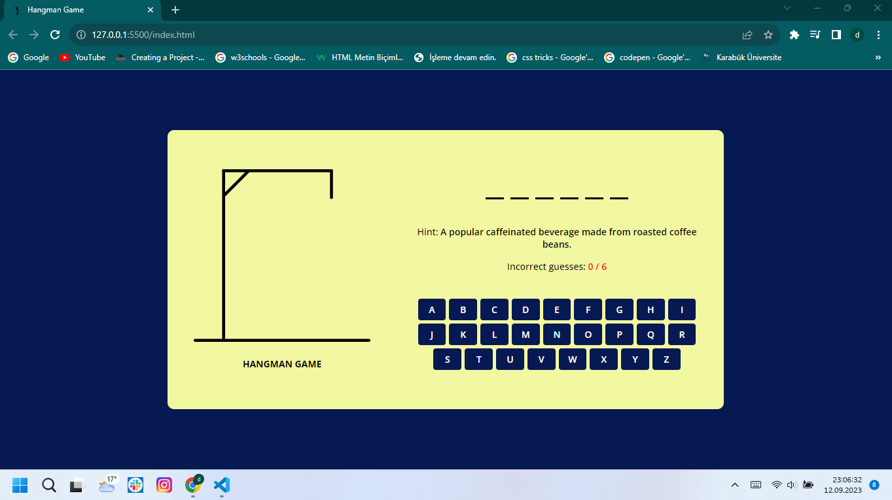

# Hangman-Game

Hangman Oyunu
Bu proje, klasik bir kelime tahmin oyunu olan Hangman'i (Adam Asmaca) uygulayan bir programı içerir. Oyuncular, belirli bir kelimenin harf harf tahminlerini yaparlar ve tahminlerinin doğruluğunu kontrol ederler. Oyuncunun belirli bir süre içinde kelimeyi tamamlaması gerekmektedir.

Özellikler
Rastgele seçilen kelimelerle oynama.
Belirli bir süre içinde kelimeyi tamamlama.
Kullanıcı dostu bir arayüze sahip olma.
Oyun sonuçlarını kaydetme.
Başlarken
Bu projeyi yerel ortamınızda çalıştırmak ve geliştirmek için aşağıdaki adımları izleyebilirsiniz.

Bu deposu yerel makinenize kopyalayın:

bash
Copy code
git clone https://github.com/DurmusFSD/Hangman-Game.git
Proje klasörüne gidin:

bash
Copy code
cd hangman-game
Gerekli bağımlılıkları yükleyin:

bash
Copy code
npm install
Oyunu başlatın:

bash
Copy code
npm start
Tarayıcınızı açın ve http://localhost:3000 adresine gidin.

Kullanım
Oyun başladığında, oyuncuya rastgele bir kelime gösterilir ve kelimenin harf harf tahminlerini yapması istenir. Tahmin edilen harf doğru ise kelime üzerinde gösterilir, yanlış ise yanlış tahminler listesine eklenir. Oyuncu, belirli bir süre içinde kelimeyi tamamlamaya çalışır.

Katkıda Bulunma
Eğer bu projeye katkıda bulunmak isterseniz, lütfen aşağıdaki adımları izleyin:

Bu projeyi forklayın.
Yeni bir özellik veya hata düzeltmesi ekleyin.
Değişikliklerinizi yapın ve düzenli bir şekilde commit'leyin.
Bir pull isteği (pull request) açın ve değişikliklerinizi tartışmaya açın.
Lisans
Bu proje MIT lisansı altında lisanslanmıştır. Daha fazla bilgi için LICENSE dosyasına bakın.

İletişim
Eğer herhangi bir sorunuz veya geri bildiriminiz varsa, lütfen [email protected] adresi üzerinden bizimle iletişime geçin.

Teşekkürler
Bu projeyi kullanmayı tercih ettiğiniz için teşekkür ederiz!

Durmuş Özgül
